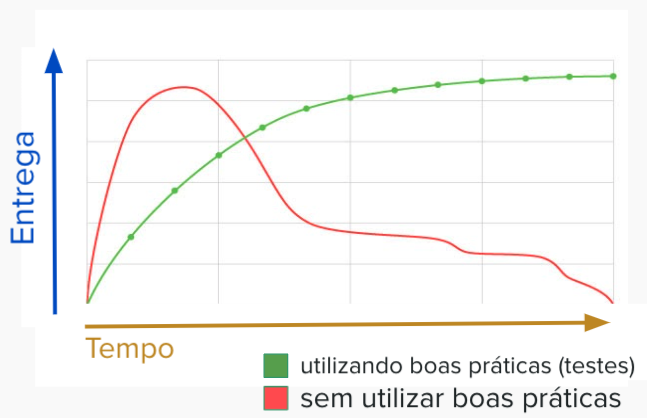

# Testes Unitários com Javascript e Jest

Testes unitários são testes que validam pequenas unidades lógicas e regras de negócio da sua aplicação de forma simples e automatizada. É uma prática essencial para todo e qualquer sistema pois garantem que seu código está sendo construído com qualidade e proporciona uma segurança mínima e necessária para a evolução e melhoria contínua da sua aplicação. Além disso, quando bem construídos, funcionam como uma espécie de documentação viva das suas regras de negócio: é muito natural recorrer aos testes unitários para entender o que alguns trechos de código estão fazendo ao invés de gastar energia entendendo linha a linha de uma dada função.

## Código com testes X Código sem testes

Em um primeiro momento, pode parecer que escrever testes unitários pode desacelerar a entrega das suas funcionalidades. Porém hoje, no mercado, as empresas mais relevantes tem se preocupado ainda mais com essa prática porque essa perda de velocidade inicial é uma ilusão e o preço de não aplicar práticas como testes unitários se torna muito caro em um médio prazo. Como no grático abaixo:



A linha vermelha indica a quantidade de funcionalidades entregues nos primeiros dias ou poucas semanas de projeto. Observe que, de fato, temos uma entrega de valor mais alta do que a linha verde, que representa um código escrito utilizando boas práticas como a de escrever testes unitários. Porém, com o tempo, um código sem testes torna-se rapidamente o que chamamos de código legado: conceito dado para um código onde torna-se muito difícil e custoso sua manutenção e criação de novas funcionalidades. Isso se dá porque, sem testes para garantir o funcionamento correto do seu software, qualquer novo código escrito pode impactar o que já foi entregue e, por não haverem testes automatizados, esses erros são percebidos tarde demais.

Por outro lado, a linha verde pode demorar um pouco mais inicialmente por causa da construção de testes, mas graças a eles geramos um software mais sustentável, onde a manutenção e evolução tornam-se mais rápidas e garantem uma quantidade muito menor de bugs e comportamentos inesperados.

Logo, tenham em mente que a criação de testes unitários é imprescindível para qualquer que seja a aplicação. Hoje, raramente se vê empresas maduras de tecnologia criando software sem esse tipo de testes.

## Configuração do projeto

Vamos utilizar javascript puro e uma biblioteca chamada jest para os testes unitários. Nossa primeira missão vai ser construir uma calculadora com as operações de somar, diminuir, multiplicar e dividir. 

Na pasta onde você vai criar o projeto, execute o comando
```bash
npm init -y
```
Ele vai automaticamente criar um projeto javascript com o mesmo nome da pasta onde você rodou esse comando.

Para instalar o jest, execute:
```bash
npm i jest --save-dev
```
O argumento --save-dev é para deixar claro que essa biblioteca não faz parte do seu código de produção e será utilizada somente nos ambientes de desenvolvimento. Assim, seu artefato final fica menos pesado pois qualquer biblioteca instalada com esse argumento é removida.

Agora, precisamos configurar um comando que, quando executado, vai rodar todos os seus testes unitários e verificar se há algum erro com a sua lógica. Para isso, no arquivo `package.json` substitua o valor da chave `test` para `jest` ao invés do padrão criado inicialmente:

```javascript
"scripts": {
    "test": "jest"
},
```

Por padrão, o Jest executa os testes dentro da pasta `__tests__`. Então, vamos cria-la:

```bash
mkdir __tests__
```

## Construinto nossos primeiros testes unitários
Vamos construir então, em um novo arquivo chamado `calculator.js` a função de soma de dois valores. Vamos considerar que a calculadora aceita somente números inteiros.
```javascript
function sum(a, b) {
    return a + b;
}
```
E agora, vamos construir um teste unitário para essa função. Um ponto importante é a nomenclatura desses testes: por eles serem uma documentação viva da sua aplicação, ter um padrão de nomenclatura claro é muito importante para entendimento futuro tanto seu quanto do seu time.

Crie um arquivo, dentro da pasta `__tests__`, chamado `calculator.spec.js`. Dentro dele, vamos criar nosso primeiro teste:
```javascript
import { sum } from '../calculator.js';

describe("calculator sum", () => {
  test("it should sum two positive values", () => {

    const result = sum(2, 2);

    expect(result).toEqual(4);

  });
});
```
Para melhor organização dos nossos testes, utilizamos a keyword `describe` para mostrar qual função estamos testando naquele conjunto de testes e a keyword `test` para explicitar de fato o que está sendo testado e o comportamento esperado.

Agora, executando o comando `npm test`, vamos verificar que nosso teste passou e podemos seguir em frente.

OBS: Caso você esteja tendo problemas como esse:
```
 Jest encountered an unexpected token

    Jest failed to parse a file. This happens e.g. when your code or its dependencies use non-standard JavaScript syntax, or when Jest is not configured to support such syntax.

    Out of the box Jest supports Babel, which will be used to transform your files into valid JS based on your Babel configuration.
    ...
```
Siga o seguinte tutorial: https://newbedev.com/jest-syntaxerror-cannot-use-import-statement-outside-a-module]

Vamos agora criar um segundo caso de teste, por exemplo, somando um número negativo. É muito importante pensarmos em cenários diferentes do padrão para deixar nossa aplicação ainda mais robusta a nível de testes automatizados. Dentro do mesmo describe e logo abaixo do primeiro fechamento de chaves e parenteses `})` vamos escrever o segundo teste:

```javascript
test("it should sum numbers with a negative value values", () => {
  const result = sum(2, -2);
  
  expect(result).toEqual(0);
});
```

## E quando um teste falha?
Vamos adicionar a função de subtrair na nossa calculadora e, por um descuido (proposital), errar a lógica da função. Então, no arquivo `calculator.js`

```javascript
export function subtract(a, b) {
    return a + b;
}
```

E o teste, em um outro describe, no `calculator.spec.js`, abaixo do segundo fechamento de chaves e parenteses `})`. Não se esqueça de adicionar no import, no topo do arquivo de teste, a função `subtract` ao lado de `sum` separado por uma `,`

```javascript
import { sum, subtract } from '../calculator.js';
```

E o teste:
```javascript
describe("calculator subtract", () => {
    test("it should subtract two positive values", () => {

    const result = subtract(2, 2);

    expect(result).toEqual(0);

  });
});
```
Observe que, no terminal, o Jest exibe um relatório bem certeiro do que está errado:

```
calculator sum
    ✓ it should sum two positive values (2 ms)
    ✓ it should sum numbers with a negative value values
  calculator subtract
    ✕ it should subtract two positive values (2 ms)

  ● calculator subtract › it should subtract two positive values

    expect(received).toEqual(expected) // deep equality

    Expected: 0
    Received: 4
```
O texto deixa bem claro que o valor esperado seria 0, mas o obtido foi 4. Ele também, no início, indica quais testes falharam.
Corrija o erro de lógica e rode os testes novamente antes de continuarmos.

## Casos de borda