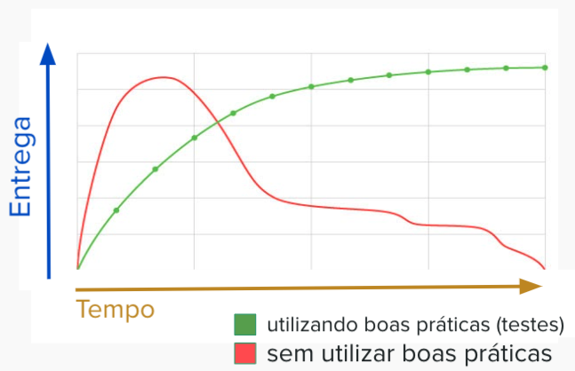

# Aula 1 - Testes Unitários com JavaScript e Jest



## Código com testes vs. Código sem testes

Em um primeiro momento, pode parecer que escrever testes unitários pode desacelerar a entrega das suas funcionalidades. Porém, atualmente, as empresas mais relevantes tem se preocupado ainda mais com essa prática, justamente pelo fato de que não aplicar práticas como testes unitários aumenta muito o custo do projeto em um médio prazo, como no gráfico a seguir:

A linha vermelha indica a quantidade de funcionalidades entregues nos primeiros dias ou poucas semanas de projeto. Observe que, de fato, temos uma entrega de valor mais alta do que a linha verde, que representa um código escrito utilizando boas práticas como a de escrever testes unitários.

Porém, com o tempo, um código sem testes torna-se rapidamente o que chamamos de código legado.

> **Código legado:** conceito dado para um código onde torna-se muito difícil e custoso sua manutenção e criação de novas funcionalidades.

Isso se dá porque, sem testes para garantir o funcionamento correto do seu software, qualquer novo código escrito pode impactar o que já foi entregue e, por não haverem testes automatizados, esses erros são percebidos tarde demais.

Por outro lado, a linha verde pode subir um pouco mais lenta de início por causa da construção de testes, mas, graças a eles, geramos um software mais sustentável, em que a manutenção e evolução tornam-se mais rápidas e garantem uma quantidade muito menor de bugs e comportamentos inesperados.

Logo, tenham em mente que a criação de testes unitários é imprescindível para qualquer que seja a aplicação. Hoje, raramente vemos empresas maduras de tecnologia criando software sem esse tipo de testes.

## O que teremos neste curso?

