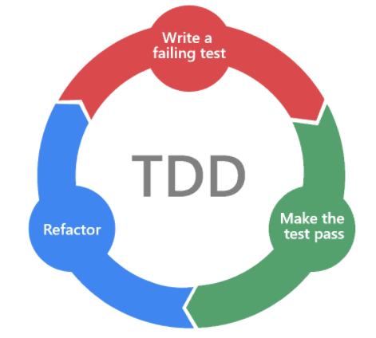

# Aula 3 - Casos de borda e TDD



### Casos de borda

Casos de borda são cenários que extrapolam o previsível e o que consideramos "básico".

É sempre preciso pensar fora da caixa e entender que podem acontecer comportamentos inesperados com nossas funções dependendo do seu comportamento e dos parâmetros que ela recebe. Por exemplo:

* Faz sentido uma conta ter um valor negativo de saldo?
* Ou transferir um valor negativo de uma conta para outra?

A forma que nossa função se comporta nesses casos deve estar explícita tanto nas regras de negócio descritas na aplicação, quanto nos testes unitários. Por exemplo:

```javascript
export function transfer(payer, receiver, transferAmount) {
  if (transferAmount > 0) {
      payer.balance = payer.balance - transferAmount;
      receiver.balance = receiver.balance + transferAmount;

      return [payer, receiver];
  } else {
      throw new Error(`Invalid transfer amount: ${transferAmount}`);
  }
}
```

E este seria o teste unitário para esse caso de borda:

```javascript
test('it should throw an error when transfer amount is negative', () => {
    const payerAccount = new Account(1, 1000);
    const receiverAccount = new Account(2, 1000);

    const updatedAccounts = () => {
        transfer(payerAccount, receiverAccount, -10);
    };

    expect(updatedAccounts).toThrow(Error('Invalid transfer amount: -10'));
});
```

E acabamos de chegar em outro caso de borda bastante comum em diversas aplicações:

> **Será que faz sentido transferirmos o valor 0 de uma conta para outra?**

Pensando que estamos construindo um banco, seria um processamento desnecessário, pois não fará qualquer diferença para nenhuma das contas.

Logo, é muito interessante criarmos um teste para garantir que nossa função também gere um erro caso receba o parâmetro `0` de valor de transferência.

```javascript
test('it should throw an error when transfer amount is 0', () => {
    const payerAccount = new Account(1, 1000);
    const receiverAccount = new Account(2, 1000);

    const updatedAccounts = () => {
        transfer(payerAccount, receiverAccount, 0);
    };

    expect(updatedAccounts).toThrow(Error('Invalid transfer amount: 0'));
});
```

Como na lógica da nossa função decidimos optar pela condicional `if amount > 0`, o teste vai passar e vai garantir que não haverá processamento de transferência de valor `0`.

Mas, se optássemos por um `>=` (maior ou igual), o teste falharia, pois é uma regra da aplicação não realizar transferências de valor `0`.

### Test Driven Development (TDD)



TDD, ou desenvolvimento orientado a testes, é uma prática de qualidade de código vista com muito bons olhos no mercado. Ela, através de testes unitários, contribui para a criação de um código mais limpo, legível e sustentável.

A ideia é, antes de qualquer coisa, criar um teste unitário de alguma regra de negócio específica e assistir ele falhar propositalmente. Na sequência, você irá começar a desenvolver sua função baseada nesse teste.

#### Exemplo de TDD

Vamos exemplificar para facilitar:

Imagine que chegou uma nova demanda de negócio na nossa aplicação bancária e agora será cobrada uma taxa de 100 "dinheiros" (não vamos nos apegar a valores monetários aqui) para o pagante realizar uma transferência.

Sem encostar no nosso código de produção (nome dado a parte do código fonte sem os testes), vamos primeiro criar um teste com essa nova regra de negócio.

Para fins didáticos, vamos separar esse novo teste em um outro arquivo.

Primeiro, crie o arquivo `transferWithTax.spec.js` dentro da pasta `__tests__`, com o seguinte conteúdo:

```javascript
import { Account } from '../account.js';
import { transferWithTax } from '../transferWithTax.js';

describe('transferWithTax', () => {
    test('it should charge 100 from the payer account with 1000 for a 500 transfer to a receiver account with 0', () => {
        const payerAccount = new Account(1, 1000);
        const receiverAccount = new Account(2, 0);

        const updatedAccounts = transferWithTax(payerAccount, receiverAccount, 500);

        expect(updatedAccounts).toEqual(
            expect.arrayContaining([
                expect.objectContaining({id: 1, balance: 400}),
                expect.objectContaining({id: 2, balance: 500}),
            ])
        );
    });
});
```

Vamos criar um novo arquivo `transferWithTax.js`, e uma nova função, `transferWithTax`, que retornará `undefined` apenas para conseguir rodar os testes sem erros de compilação.

```javascript
import { Account } from "./account";

export function transferWithTax(payer, receiver, transferAmount) {
    return undefined;
}
```

Agora, para rodar os testes, execute:

```bash
npm test __tests__/transferWithTax.spec.js
```

Ao executar o comando, percebemos que o teste falhou e é essa a primeira parte do TDD: **criar um micro-objetivo (teste unitário) que falhe**.

**Fazendo o teste passar**

A próxima etapa agora é fazer esse teste passar:

* Deixe TUDO de lado e preocupe-se unicamente em fazer esse teste passar, da forma que for, sem se preocupar com legibilidade, design ou boas práticas (pode confiar).
* Podem ignorar outras regras de negócio, casos de borda e complexidades.

Sendo bem pragmático e seguindo o TDD "by the book" (no dia a dia, não necessariamente precisamos fazer desse jeito), podemos fazer o teste passar da seguinte forma:

```javascript
export function transferWithTax(payer, receiver, transferAmount) {
    return [new Account(1, 400), new Account(2, 500)];
}
```

Sim, isso mesmo, retornamos exatamente o que o teste espera.

O TDD serve para você reduzir o seu problema em micro objetivos que, quando totalmente concluídos, resolvem o problema como um todo.

**Refatoração**

Agora, nós vamos para a terceira parte do TDD: **a refatoração**.

Já que temos nossa suite de testes verde (passando), temos segurança para melhorar a legibilidade e o design do nosso código que, com certeza, tem muito a melhorar. Então, voltamos ao arquivo `transferWithTax.js,` para melhorar nosso algoritmo e torná-lo mais legível.

```javascript
export function transferWithTax(payer, receiver, transferAmount) {
    const payerBalance = 400;
    const payerAccountId = 1;
    const payerAccount = new Account(payerAccountId, payerBalance);

    const receiverBalance = 500;
    const receiverAccountId = 2;
    const receiverAccount = new Account(receiverAccountId, payerBalance);

    return [payerAccount, receiverAccount];
}
```

Nessa refatoração, melhoramos a legibilidade do código removendo um code smell (padrão ruim de código) chamado `magic number` (números mágicos), que são números escritos sem contexto no meio do código.

Ao declararmos eles a variáveis com nomes descritivos, fica mais fácil entender o que cada um desses números significa.

No entanto, propositalmente, inserimos um erro nessa refatoração.

Rode os testes com o seguinte comando:

```bash
npm test __tests__/transferWithTax.spec.js
```

E temos o seguinte resultado:

```
Expected: ArrayContaining [ObjectContaining {"balance": 500, "id": 1}, ObjectContaining {"balance": 400, "id": 2}]
Received: [{"balance": 500, "id": 1}, {"balance": 500, "id": 1}]
```

Esse é o relatório que o jest nos trouxe. A conta recebedora da transferência deveria estar com 400 "dinheiros", mas nossa função retornou que ela está com 500.

**Corrigindo possíveis erros**

Algo deu errado na nossa refatoração, conseguem descobrir o que é?

Na linha 11, trocamos uma variável de lugar. Ao invés de a conta receber o saldo do recebedor, ela estava recebendo a do pagador (erros de copiar e colar são os mais comuns na área de programação e vocês vão lembrar muito disso!).

```javascript
const receiverAccount = new Account(receiverAccountId, receiverBalance);
```

Feita a alteração, rodamos os testes novamente com:

```bash
npm test __tests__/transferWithTax.spec.js
```

E... sucesso! 🍀👌

A etapa de refatoração é muito importante, pois, como já falamos anteriormente, nosso código evolui e muda o tempo todo.

> **DICA ❗❗:** Nunca refatore um código se a suíte de testes estiver vermelha (não estiverem passando), pois dessa forma não existe garantia que sua refatoração não introduziu bugs e comportamentos inesperados.

E, assim, fechamos o ciclo do TDD e iniciamos a primeira etapa da prática: escrever um teste válido que falhe ao ser executado, como na imagem:



**Escrevendo um novo caso de teste**



Agora, retornamos ao início e escrevemos mais um teste para nossa funcionalidade:

```javascript
test('it should charge 100 from the payer account with 2000 for a 100 transfer to a receiver account with 1000', () => {
    const payerAccount = new Account(1, 2000);
    const receiverAccount = new Account(2, 1000);

    const updatedAccounts = transferWithTax(payerAccount, receiverAccount, 100);

    expect(updatedAccounts).toEqual(
        expect.arrayContaining([
            expect.objectContaining({ id: 1, balance: 1800 }),
            expect.objectContaining({ id: 2, balance: 1100 }),
        ])
    );
});
```

Execute os testes:

```bash
npm test __tests__/transferWithTax.spec.js
```

Ao rodar os testes, vemos que, pelo relatório, o teste falha (obviamente), pois nosso algoritmo não está completo.

O novo objetivo agora é fazer esse teste passar, sendo que podemos começar a dar passos maiores e adicionar mais lógica na nossa função:

```javascript
export function transferWithTax(payer, receiver, transferAmount) {
    const payerAccountAfterTransfer = new Account(payer.id, payer.balance - transferAmount - 100);
    const receiverAccountAfterTransfer = new Account(receiver.id, receiver.balance + transferAmount);

    return [payerAccountAfterTransfer, receiverAccountAfterTransfer];
}
```

Rodando os testes novamente com o mesmo comando, podemos ver que acertamos no nosso algoritmo.

Para finalizar, pulamos para a terceira etapa do TDD, **a refatoração**.

O que podemos melhorar nesse código?

```javascript
export function transferWithTax(payer, receiver, transferAmount) {
    const payerAccountAfterTransfer = new Account(payer.id, chargeTaxForTransfer(payer.balance, transferAmount));
    const receiverAccountAfterTransfer = new Account(receiver.id, receiver.balance + transferAmount);

    return [payerAccountAfterTransfer, receiverAccountAfterTransfer];
}

function chargeTaxForTransfer(balance, transferAmount) {
    const tax = 100;
    return balance - transferAmount - tax;
}
```

Nessa refatoração, extraímos parte da lógica para uma função com nome mais descritivo e legível a cobrança da taxa, além de declarar essa taxa a uma variável com um nome mais declarativo.

Rodando nossos testes com o mesmo comando, observamos que nossa refatoração deu certo: deixou o código mais limpo, com mais facilidade de manutenção, mais legível e continua com o comportamento esperado pelo negócio.
